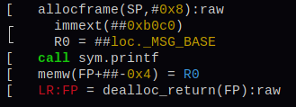
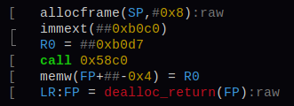

# Assembly Strings

## Colorizing asm strings

There are two ways we colorize our asm strings.

1. The generic method. For straight forward `<mnemonic> <op> <op>` syntax.
2. The custom method. Which allows for way more complicated assembly syntax. 

In both methods we start by assigning tokens to sub-strings of the asm string.

### Tokenizing

A token itself simply is a reference a sub-string.
So it contains an offset into the asm string where a sub-string starts.
And the length of the sub-string in bytes as well as the token type.

```c
typedef struct {
	size_t start; //< byte-offset into `str` where this token starts. Must be exactly at a utf-8 codepoint boundary.
	size_t len; //< `str` length of token in bytes.
	RzAsmTokenType type;
  // ...
} RzAsmToken;
```

Here is a list of some token types:

```c
typedef enum {
	RZ_ASM_TOKEN_UNKNOWN = 0, //< Does not fit to any token below.
	RZ_ASM_TOKEN_MNEMONIC, //< Asm mnemonics like: mov, push, lea...
	RZ_ASM_TOKEN_OPERATOR, //< Arithmetic operators: +,-,<< etc.
	RZ_ASM_TOKEN_NUMBER, //< Numbers
	RZ_ASM_TOKEN_REGISTER, //< Registers
	RZ_ASM_TOKEN_SEPARATOR, //< Brackets, comma etc.
	RZ_ASM_TOKEN_META, //< Meta information (e.g Hexagon packet prefix, ARM & Hexagon number prefix).
  // If needed add one here.
} RzAsmTokenType;
```

Let's look at an example:

```asm
add r0, r1, 0x10
```

This asm string would be split into 7 tokens:

| Sub-String | start | length |   type    |
|------------|-------|--------|-----------|
| `add`      | 0     | 3      | mnemonic  |
| ` `        | 3     | 1      | separator |
| `r0`       | 4     | 2      | register  |
| `, `       | 6     | 2      | separator |
| `r1`       | 8     | 2      | register  |
| `, `       | 10    | 2      | separator |
| `0x10`     | 12    | 4      | number    |

A vector of those tokens now describes the whole asm string.

```c
typedef struct {
	ut32 op_type; ///< RzAnalysisOpType. Mnemonic color depends on this.
	RzStrBuf *str; ///< Contains the raw asm string
	RzVector /*<RzAsmToken>*/ *tokens; ///< Contains only the tokenization meta-info without strings, ordered by start for log2(n) access
} RzAsmTokenString;
```

Note the `op_type` member. It should get a `RzAnalysisOpType` assigned to it.
Depending on this type, the coloring of the mnemonic will differ.

### Coloring

Coloring the token vector becomes very straight forward.
We simply append each token to each other and insert the color escape sequences before and after each sub-string.

### General tokenize method

The general method assumes that the asm string is roughly of the following form:

```
<mnemonic><separator><operand><separator><operand>...
```

This is the standard parsing pattern. It will be applied if no custom patterns are implemented by the asm module.
For parsing details refer to the documentation in the code (see: `tokenize_asm_generic()`).

### Custom tokenizing of an asm string.

Custom tokenizing of asm strings can be done for complicated or obscure asm strings.

To implement this for an asm module you need to:

1. Define regex patterns for each token type.
2. Parse the asm string in the `disassemble()` function of the asm module.

**Implementation**

In this example we implement tokenization for `bf` assembly.

If we disassemble `[->+<]` (adding two numbers) we get

```
while [ptr]
dec [ptr]
inc ptr
inc [ptr]
dec ptr
loop
```

First add the following function to `asm_bf.c`:

```c
static RZ_OWN RzPVector /*<RzAsmTokenPattern *>*/ *get_token_patterns() {
	static RzPVector *pvec = NULL;
	if (pvec) {
		return pvec;
	}

	pvec = rz_pvector_new(rz_asm_token_pattern_free);

	// Patterns get added here.
}
```

Now we can add the regex patterns for each token type and append them to the vector.

The mnemonics of the `bf` assembly are: `while`, `inc`, `dec`, `trap`, `nop`, `invalid`
and `loop`. We treat `ptr` as a register for simplicity.
We also have the separator ` ` and the operation `[]` (reference the value at `ptr`).

Now we add the regex patterns.

Note, the first patterns in the vector are matched first as well.
They have a higher priority. With the correct ordering, you can prevent conflicts between patterns.
You can also add multiple patterns of the same type. Each of which is further up or down in priority.

```c
static RZ_OWN RzPVector /*<RzAsmTokenPattern *>*/ *get_token_patterns() {
	// ...

	// Patterns get added here.
	// Mnemonic pattern
	RzAsmTokenPattern *pat = RZ_NEW0(RzAsmTokenPattern);
	pat->type = RZ_ASM_TOKEN_MNEMONIC;
	pat->pattern = strdup(
		"^((while)|(inc)|(dec)|(trap)|(nop)|(invalid)|(loop))"
	);
	rz_pvector_push(pvec, pat);

	// ptr pattern
	pat = RZ_NEW0(RzAsmTokenPattern);
	pat->type = RZ_ASM_TOKEN_REGISTER;
	pat->pattern = strdup(
		"(ptr)"
	);
	rz_pvector_push(pvec, pat);

	// reference pattern
	pat = RZ_NEW0(RzAsmTokenPattern);
	pat->type = RZ_ASM_TOKEN_OPERATOR;
	pat->pattern = strdup(
		"(\\[)|(\\])" // Matches a single bracket
	);
	rz_pvector_push(pvec, pat);

	// Separator pattern
	pat = RZ_NEW0(RzAsmTokenPattern);
	pat->type = RZ_ASM_TOKEN_SEPARATOR;
	pat->pattern = strdup(
		"([[:blank:]]+)"
	);
	rz_pvector_push(pvec, pat);

	return pvec;
}
```

Now we can parse every disassembled asm string into tokens by passing it to `rz_asm_tokenize_asm_regex()`.
The result should be assigned to `RzAsm.asm_toks`.
In our example we do it in `disassemble()`.

```c
	// ...
		op_type = RZ_ANALYSIS_OP_TYPE_TRAP;
		buf_asm = "trap";
		break;
	default:
		op_type = RZ_ANALYSIS_OP_TYPE_NOP;
		buf_asm = "nop";
		break;
	}

	rz_strbuf_set(&op->buf_asm, buf_asm);

	RzPVector *token_patterns = get_token_patterns();
	op->asm_toks = rz_asm_tokenize_asm_regex(&op->buf_asm, token_patterns);
	op->asm_toks->op_type = op_type;

	// ...
}
```
If `RzAsm.asm_toks` is not `NULL` the tokens will be used to colorize the asm string.

The color of the mnemonic token is defined by the operation type.
So ensure that `RzAsmTokenString.op_type` is set correctly.

### What for?

For simple syntax the custom method might seem overengineered.

But defining properly which part of an asm string means what, has additional advantages.

- Numbers can be extracted from the string and used later.
- If some syntax needs to be manipulated, it is way easier to do this.
  Selecting the token with the right type and change it. No raw string operations anymore.
- For complex syntax it will produce beautiful results.

Here is an example for the last point.

The general method:



The custom method:



As you see, the custom method is way more beautiful.

Check out `asm_hexagon.c` for an example of the complex patterns used for it.
