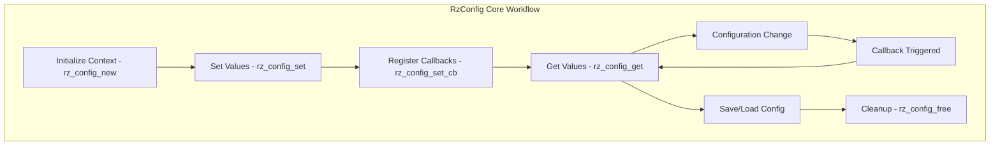

# RzConfig

The Rizin configuration library, `RzConfig`, provides a unified system for managing configuration variables and settings throughout the Rizin framework. It enables dynamic runtime configuration of various components and behaviors.

The `RzConfig` structure maintains a hierarchical configuration system with support for different variable types, validation callbacks, and change notifications.

## What can I expect here?

- Unified configuration management system
- Support for multiple configuration variable types:
  - Strings
  - Numbers (integers, floats)
  - Booleans
  - Lists and sets
- Core functions for configuration lifecycle:
  - `rz_config_new()`: To initialize a configuration context
  - `rz_config_set()`: To set configuration values
  - `rz_config_get()`: To retrieve configuration values
  - `rz_config_set_cb()`: To register change callbacks
  - `rz_config_free()`: To release the configuration context
- Hierarchical configuration organization
- Configuration value validation
- Configuration change callbacks and observers
- Persistent configuration storage and loading
- Configuration reset and defaults

## Architecture

The configuration system uses a property-based approach where each configuration item has:

- **Name**: Unique identifier (e.g., "asm.arch", "asm.bits", "scr.utf8")
- **Value**: Current setting value
- **Type**: Variable type (string, number, boolean, etc.)
- **Description**: Human-readable description
- **Callback**: Optional function called when value changes
- **Range/Options**: Valid values or ranges for the setting
## RzConfig Core Workflow


## Configuration Categories

Configuration variables are typically organized by prefix:

- **asm.\***: Assembly/disassembly settings (architecture, bits, syntax)
- **bin.\***: Binary analysis settings
- **scr.\***: Screen/console output settings
- **dbg.\***: Debugging settings
- **search.\***: Search/find settings
- **colors.\***: Color scheme settings
- **core.\***: Core analysis settings
- **io.\***: Input/output settings

## Key Structures

### RzConfig
The main configuration context managing all settings.

### RzConfigNode
Individual configuration node containing:
- Name
- Value
- Type
- Description
- Callback function
- Validation rules

## Usage Examples

### Example: Setting Configuration Values

```c
#include <rz_config.h>
#include <stdio.h>

int main(void) {
	// Create a configuration context
	RzConfig *cfg = rz_config_new();
	if (!cfg) {
		return 1;
	}

	// Set assembly architecture to x86 with 32-bit
	rz_config_set(cfg, "asm.arch", "x86");
	rz_config_set(cfg, "asm.bits", "32");
	
	// Enable UTF-8 output
	rz_config_set(cfg, "scr.utf8", "true");
	
	// Get values back
	const char *arch = rz_config_get(cfg, "asm.arch");
	printf("Current architecture: %s\n", arch);
	
	// Cleanup
	rz_config_free(cfg);
	return 0;
}
```

### Example: Registering Change Callbacks

```c
// Callback function for configuration changes
static int config_callback(void *user, void *data) {
	RzConfigNode *node = (RzConfigNode *)data;
	printf("Configuration changed: %s = %s\n", node->name, node->value);
	return 0;
}

// Register callback for specific setting
rz_config_set_cb(cfg, "asm.arch", config_callback, NULL);

// When configuration changes, callback will be invoked
rz_config_set(cfg, "asm.arch", "arm");
```

## Configuration Examples

### Assembly Configuration
- **asm.arch**: Target architecture (x86, arm, mips, etc.)
- **asm.bits**: Architecture bit-width (32, 64)
- **asm.syntax**: Assembly syntax style (intel, att, etc.)

### Display Configuration
- **scr.utf8**: Enable UTF-8 output for better visuals
- **scr.columns**: Terminal width
- **scr.rows**: Terminal height

### Analysis Configuration
- **core.maxstringlen**: Maximum string length for analysis
- **core.asmtabs**: Enable assembly tabs for formatting

### Debug Configuration
- **dbg.backend**: Debugger backend to use
- **dbg.follow**: Follow child processes

## Features

- **Type Safety**: Enforce variable types during set operations
- **Validation**: Optional validation callbacks prevent invalid settings
- **Observability**: Change notifications allow components to react to settings
- **Persistence**: Save/load configuration to/from files
- **Defaults**: Built-in sensible defaults for all settings
- **Documentation**: Each setting has a description for help systems
- **Namespacing**: Hierarchical organization of settings

## Common Patterns

- **Boolean settings**: Use "true"/"false" strings or "0"/"1"
- **Numeric settings**: Values stored as strings, parsed as needed
- **List settings**: Comma-separated values or dedicated list types
- **Enum settings**: Limited set of valid options

## Integration with Rizin Components

Most Rizin libraries read configuration to control their behavior:
- **RzArch**: Uses `asm.arch`, `asm.bits`
- **RzCons**: Uses `scr.*` settings
- **RzCore**: Uses various `core.*` and `search.*` settings
- **RzDebug**: Uses `dbg.*` settings
