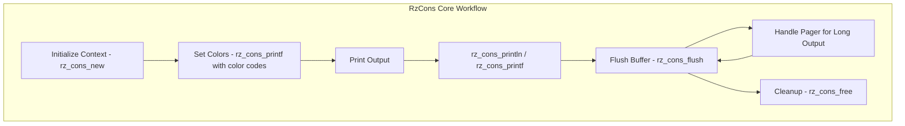

# RzCons

The Rizin console library, `RzCons`, handles all console input/output operations, including text rendering, color management, table formatting, and interactive terminal features. It provides a unified interface for console operations across different platforms.

The `RzCons` structure manages console state, output buffers, color schemes, and terminal capabilities.

## What can I expect here?

- Cross-platform console I/O operations
- Rich text output with color support:
  - ANSI color codes for terminals
  - HTML color output
  - Custom color schemes
- Advanced formatting features:
  - Table rendering with alignment
  - Progress bars and status indicators
  - Menu and selection interfaces
  - Hexdump/disassembly-style formatting
- Core functions for console lifecycle:
  - `rz_cons_new()`: To initialize a console context
  - `rz_cons_println()`: To print lines
  - `rz_cons_printf()`: For formatted output
  - `rz_cons_print()`: To print raw text
  - `rz_cons_free()`: To release the console context
- Terminal capability detection and adaptation
- Color and style management
- Output buffering and flushing
- Console size detection and handling
- Pager support for long output

## Architecture

The console library uses a buffer-based approach for output management:

- **`RzCons` Context**: Main console state manager
- **Output Buffer**: Accumulates text before flushing
- **Color System**: Manages colors and ANSI codes
- **Terminal Context**: Handles terminal capabilities and dimensions
- **Pager**: Manages scrollable output
## RzCons Core Workflow


## Key Structures

### RzCons
Main console context containing:
- Output buffer
- Color scheme
- Terminal dimensions
- Configuration
- Pager state

### RzConsColor
Color information for styled output:
- Foreground color
- Background color
- Text attributes (bold, italic, underline)

## Color Support

### ANSI Colors

Standard terminal colors are supported:
- **Black, Red, Green, Yellow, Blue, Magenta, Cyan, White**
- **Bright variants** for better visibility
- **256-color palettes**
- **True color (24-bit RGB)**

### Color Codes in Output

Colors can be specified using shorthand codes:
- `\x1b[31m`: Red
- `\x1b[32m`: Green
- `\x1b[33m`: Yellow
- `\x1b[0m`: Reset

### Output Formats

- **ANSI**: For terminal output with colors
- **HTML**: For web-based or offline viewing
- **Plain**: Plain text without formatting

## Usage Examples

### Example: Colored Console Output

```c
#include <rz_cons.h>

int main(void) {
	// Create a console context
	RzCons *cons = rz_cons_new();
	if (!cons) {
		return 1;
	}

	// Print colored output
	rz_cons_printf("[32m"); // Green color
	rz_cons_println("Analysis Result:");
	rz_cons_printf("[0m");  // Reset color

	// Print normal text
	rz_cons_println("No color here");

	// Colored output with reset
	rz_cons_printf("[33m[1m");  // Yellow, bold
	rz_cons_println("Important Message");
	rz_cons_printf("[0m");       // Reset

	// Flush output to ensure it's displayed
	rz_cons_flush();

	// Cleanup
	rz_cons_free(cons);
	return 0;
}
```

### Example: Table Formatting

```c
RzCons *cons = rz_cons_new();

// Create and fill a table
RzTable *table = rz_table_new();
rz_table_add_colsep(table, "");
rz_table_set_columnsep(table, " | ");

// Add header
rz_table_add_columns(table, "col0", "col1", "col2", NULL);

// Add rows
rz_table_add_data(table, "data0", "data1", "data2", NULL);
rz_table_add_data(table, "data3", "data4", "data5", NULL);

// Print table
rz_cons_println(rz_table_tostring(table));

rz_table_free(table);
rz_cons_free(cons);
```

### Example: Progress Bar

```c
RzCons *cons = rz_cons_new();

for (int i = 0; i <= 100; i += 10) {
	rz_cons_clear();
	rz_cons_printf("Progress: %d%%\n", i);
	rz_cons_print_progress_bar(cons, i, 100);
	rz_cons_flush();
	usleep(100000); // Sleep for visualization
}

rz_cons_free(cons);
```

## Key Features

- **Terminal Adaptation**: Detects terminal capabilities and adapts output
- **Unicode Support**: Handles UTF-8 and Unicode characters
- **Buffer Management**: Efficient buffering prevents excessive system calls
- **Color Management**: Automatic color handling for different output types
- **Platform Support**: Works on Windows, Linux, macOS
- **Pager Support**: Large output automatically paginated
- **Menu Support**: Interactive menu and selection interfaces
- **Formatting**: Advanced text formatting options

## Configuration Integration

Console behavior is controlled through configuration:
- **scr.utf8**: Enable UTF-8 output
- **scr.color**: Color mode (0=none, 1=16-color, 2=256-color, 3=true-color)
- **scr.columns**: Terminal width
- **scr.rows**: Terminal height
- **scr.pager**: Enable pager for long output

## Output Modes

### ANSI Terminal
Default mode with ANSI escape codes for colors and styling.

### HTML
Generate HTML-formatted output for web viewing or documentation.

### Plain Text
Simple text output without any formatting or colors.

### Structured Output
JSON or other structured formats for programmatic use.

## Integration Points

- Used throughout Rizin for all console output
- Integrated with RzCore for command output
- Used by RzAnalysis for disassembly display
- Used by RzDebug for breakpoint and register display
