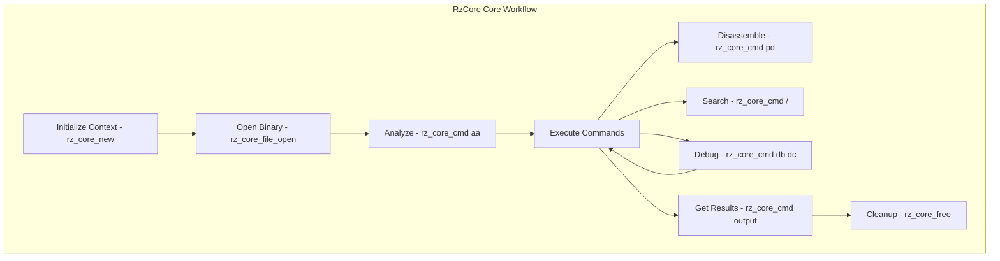

# RzCore

The Rizin core library, `RzCore`, is the central component that coordinates all major Rizin operations. It serves as the bridge between low-level analysis libraries and high-level user interfaces, managing the complete reverse-engineering workflow.

The `RzCore` structure maintains the state of a reverse-engineering session, coordinating binary analysis, assembly, debugging, and user interaction.

## What can I expect here?

- Central state management for reverse-engineering sessions
- Coordination of major Rizin components:
  - Binary file handling (RzBin)
  - Assembly and disassembly (RzAsm)
  - Binary analysis (RzAnalysis)
  - Debugging (RzDebug)
  - I/O operations (RzIO)
- Core functions for session lifecycle:
  - `rz_core_new()`: To initialize a core context
  - `rz_core_file_open()`: To open a binary for analysis
  - `rz_core_cmd()`: To execute Rizin commands
  - `rz_core_free()`: To release the core context
- Command execution engine with comprehensive command set
- Analysis and disassembly coordination
- Task management and background operations
- Breakpoint and watchpoint management
- Search and pattern matching features
- Flag and bookmark management

## Architecture

The core library functions as an orchestrator:

- **`RzCore` Context**: The central state manager
- **Component Managers**: Manages RzBin, RzAsm, RzAnalysis, RzDebug, etc.
- **Command Engine**: Executes Rizin commands
- **State Tracking**: Maintains analysis state and session information
- **Task Queue**: Manages background analysis tasks

## RzCore Core Workflow


## Key Structures

### RzCore
Main context containing:
- File handle (RzBinFile)
- Analysis context (RzAnalysis)
- Assembly context (RzAsm)
- Debug context (RzDebug)
- Configuration (RzConfig)
- Console (RzCons)
- Search state
- Task manager

### RzCoreTask
Represents background analysis tasks:
- Incremental function analysis
- Type inference
- Pattern matching

## Major Components

### Binary Management
- Load and analyze binary files
- Extract metadata and sections
- Manage multiple binary objects
- Handle relocations and imports

### Assembly/Disassembly
- Disassemble binary code sections
- Generate assembly listings
- Handle architecture-specific operations
- Support custom assembly syntax

### Analysis
- Function detection and analysis
- Call graph construction
- Data flow analysis
- Type inference
- Cross-reference tracking

### Debugging
- Attach to running processes
- Set breakpoints and watchpoints
- Single-step execution
- Register and memory inspection
- Stack frame analysis

### I/O Operations
- Memory mapping
- Virtual addressing
- Buffer management
- Multiple I/O backends

## Usage Examples

### Example: Opening and Analyzing a Binary

```c
#include <rz_core.h>
#include <stdio.h>

int main(void) {
	// Create a core context
	RzCore *core = rz_core_new();
	if (!core) {
		return 1;
	}

	// Open a binary file
	if (!rz_core_file_open(core, "/usr/bin/ls", false, 0)) {
		fprintf(stderr, "Failed to open binary\n");
		rz_core_free(core);
		return 1;
	}

	// Analyze the binary
	rz_core_cmd(core, "a", 0);  // Analyze

	// Get information
	rz_core_cmd(core, "i", 0);  // Print info

	// List functions
	rz_core_cmd(core, "afl", 0);  // List functions

	// Disassemble at entry point
	rz_core_cmd(core, "pd 20", 0);  // Print disassembly

	// Cleanup
	rz_core_free(core);
	return 0;
}
```

### Example: Seeking and Disassembling

```c
RzCore *core = rz_core_new();
rz_core_file_open(core, "binary.elf", false, 0);

// Seek to a specific address
rz_core_seek(core, 0x1000, true);

// Disassemble 10 instructions
rz_core_cmd(core, "pd 10", 0);

// Get information at current address
rz_core_cmd(core, "ai", 0);

rz_core_free(core);
```

### Example: Setting Breakpoints

```c
RzCore *core = rz_core_new();
rz_core_file_open(core, "binary.elf", false, 0);

// Attach to process or open for debugging
rz_core_cmd(core, "ood 1234", 0);  // Attach to PID

// Set breakpoint at address
rz_core_cmd(core, "db 0x1000", 0);

// List breakpoints
rz_core_cmd(core, "dbl", 0);

// Continue execution
rz_core_cmd(core, "dc", 0);

rz_core_free(core);
```

## Command System

The command system provides access to all Rizin functionality:

- **Info Commands** (`i`, `iz`, `ie`): Binary information
- **Analysis Commands** (`a`, `aa`, `afl`): Analysis operations
- **Disassembly Commands** (`pd`, `pi`, `px`): Display commands
- **Search Commands** (`/`, `/w`, `/x`): Pattern searching
- **Debug Commands** (`db`, `dc`, `dd`): Debugging operations
- **Memory Commands** (`s`, `x`, `w`): Memory operations
- **File Commands** (`o`, `om`, `oml`): File handling

## State Management

The core maintains session state:

- **Current Offset**: Position in file/memory for operations
- **Opened Files**: Multiple binary files can be open
- **Sections and Maps**: Virtual memory layout
- **Flags**: Bookmarks and labels
- **Comments**: User annotations

## Task Management

Background analysis tasks:
- Function analysis
- Cross-reference building
- Type inference
- String extraction

## Integration Points

- **RzBin**: For binary format parsing
- **RzAnalysis**: For semantic analysis
- **RzAsm**: For assembly/disassembly
- **RzDebug**: For debugging operations
- **RzIO**: For memory access
- **RzCons**: For console output
- **RzConfig**: For configuration management
- **RzFlag**: For bookmarks and labels

## Advanced Features

- **Multi-threaded Analysis**: Parallel analysis tasks
- **Incremental Analysis**: Build analysis incrementally
- **Memory Snapshots**: Capture analysis state
- **Undo/Redo**: Revert analysis changes
- **Scripting**: Command sequences and macros
