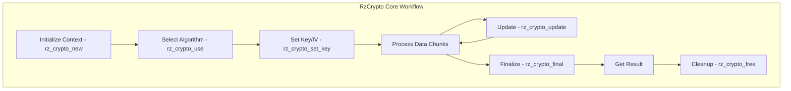

# RzCrypto

The Rizin cryptography library, `RzCrypto`, provides a unified interface to various cryptographic algorithms and operations. It enables encoding, decoding, hashing, encryption, and decryption operations throughout the Rizin framework.

The `RzCrypto` structure manages cryptographic operations with a plugin-based architecture supporting multiple algorithms and cipher modes.

## What can I expect here?

- Comprehensive cryptographic algorithm support:
  - **Symmetric Ciphers**: AES, DES, 3DES, RC4, Chacha20
  - **Asymmetric Ciphers**: RSA, ECC
  - **Hashing**: SHA1, SHA256, SHA512, MD5, BLAKE2
  - **Key Derivation**: PBKDF2, Argon2
- Core functions for cryptographic lifecycle:
  - `rz_crypto_new()`: To initialize a crypto context
  - `rz_crypto_use()`: To select an algorithm
  - `rz_crypto_set_key()`: To set the encryption key
  - `rz_crypto_update()`: To process data
  - `rz_crypto_final()`: To finalize operation
  - `rz_crypto_free()`: To release the crypto context
- Plugin-based architecture for extending supported algorithms
- Encoding/decoding operations:
  - Base64
  - Hexadecimal
  - URL encoding
  - ROT13
- Cipher modes:
  - ECB (Electronic Code Book)
  - CBC (Cipher Block Chaining)
  - CTR (Counter mode)
  - GCM (Galois/Counter Mode)

## Architecture

The cryptography library uses a plugin-based architecture for algorithm management:

- **`RzCrypto` Context**: Factory and plugin manager
- **Cipher Plugins**: Handle specific encryption algorithms
- **Hash Plugins**: Handle hashing operations
- **Encoding Plugins**: Handle encoding/decoding

## RzCrypto Core Workflow


## Key Structures

### RzCrypto
Main cryptographic context containing:
- Current algorithm state
- Key material
- Initialization vector (IV)
- Plugin registry
- Configuration

### RzCipherMode
Supported cipher modes:
- ECB: Electronic Code Book
- CBC: Cipher Block Chaining
- CTR: Counter mode
- GCM: Galois/Counter Mode

## Supported Algorithms

### Symmetric Ciphers

- **AES**: Advanced Encryption Standard (128, 192, 256-bit keys)
- **DES/3DES**: Data Encryption Standard variants
- **RC4**: Rivest Cipher 4 (stream cipher)
- **ChaCha20**: Modern stream cipher
- **Blowfish**: 64-bit block cipher
- **IDEA**: International Data Encryption Algorithm

### Asymmetric Ciphers

- **RSA**: Rivest-Shamir-Adleman cryptosystem
- **ECC**: Elliptic Curve Cryptography

### Hash Functions

- **MD5**: Message Digest 5 (128-bit)
- **SHA1**: Secure Hash Algorithm 1 (160-bit)
- **SHA256**: Secure Hash Algorithm 2 (256-bit)
- **SHA512**: Secure Hash Algorithm 2 (512-bit)
- **BLAKE2**: Modern hash function
- **RIPEMD**: RACE Integrity Primitive Evaluation Message Digest

### Encoding/Decoding

- **Base64**: Standard base64 encoding
- **Hexadecimal**: Hex encoding/decoding
- **URL Encoding**: Percent encoding
- **ROT13**: Simple letter rotation cipher
- **Base32**: RFC 4648 base32 encoding

## Usage Examples

### Example: AES Encryption/Decryption

```c
#include <rz_crypto.h>
#include <stdio.h>

int main(void) {
	// Create a crypto context
	RzCrypto *ctx = rz_crypto_new();
	if (!ctx) {
		return 1;
	}

	// Use AES cipher
	if (!rz_crypto_use(ctx, "aes")) {
		fprintf(stderr, "AES cipher not available\n");
		rz_crypto_free(ctx);
		return 1;
	}

	// Set encryption key (256 bits)
	ut8 key[32] = { /* 256-bit key */ };
	rz_crypto_set_key(ctx, key, 32);

	// Set initialization vector
	ut8 iv[16] = { /* 128-bit IV */ };
	rz_crypto_set_iv(ctx, iv, 16);

	// Plain text to encrypt
	ut8 plaintext[] = "Hello, World!!!";
	int plaintext_len = sizeof(plaintext) - 1;

	// Allocate output buffer
	ut8 ciphertext[32] = { 0 };

	// Encrypt
	rz_crypto_update(ctx, plaintext, plaintext_len);
	int encrypted_len = rz_crypto_final(ctx, ciphertext);

	// Print ciphertext as hex
	for (int i = 0; i < encrypted_len; i++) {
		printf("%02x", ciphertext[i]);
	}
	printf("\n");

	// Cleanup
	rz_crypto_free(ctx);
	return 0;
}
```

### Example: SHA256 Hashing

```c
RzCrypto *ctx = rz_crypto_new();

// Use SHA256
rz_crypto_use(ctx, "sha256");

// Data to hash
ut8 data[] = "Important message";

// Compute hash
rz_crypto_update(ctx, data, sizeof(data) - 1);
ut8 hash[32];
rz_crypto_final(ctx, hash);

// Print hash as hex
for (int i = 0; i < 32; i++) {
	printf("%02x", hash[i]);
}
printf("\n");

rz_crypto_free(ctx);
```

### Example: Base64 Encoding

```c
RzCrypto *ctx = rz_crypto_new();

// Use base64 encoding
rz_crypto_use(ctx, "base64");

// Data to encode
ut8 data[] = "Hello World";
ut8 encoded[256];

// Encode
rz_crypto_update(ctx, data, sizeof(data) - 1);
rz_crypto_final(ctx, encoded);

printf("Encoded: %s\n", (const char *)encoded);

rz_crypto_free(ctx);
```

## Key Features

- **Plugin Architecture**: Easily extend with new algorithms
- **Multiple Cipher Modes**: Support for various operational modes
- **Key Management**: Secure key handling and derivation
- **Incremental Processing**: Process data in chunks
- **Algorithm Detection**: Automatic algorithm selection
- **Performance**: Optimized implementations for critical paths
- **Cross-platform**: Works on all supported platforms

## Cipher Modes

### ECB (Electronic Code Book)
Simple mode encrypting blocks independently. Generally not recommended for production.

### CBC (Cipher Block Chaining)
Chains blocks together using IV, providing semantic security.

### CTR (Counter Mode)
Converts block cipher to stream cipher using a counter.

### GCM (Galois/Counter Mode)
Provides authenticated encryption with associated data (AEAD).

## Configuration

Cryptographic operations can be configured through:
- Key size selection
- Cipher mode specification
- Initialization vector (IV) settings
- Padding schemes (PKCS7, etc.)

## Security Considerations

- Use strong keys of appropriate length
- Generate cryptographically secure random IVs
- Use authenticated encryption modes when available
- Consider key derivation for password-based encryption
- Keep cryptographic libraries up to date

## Integration with Rizin

- **RzBin**: Decrypt protected binaries
- **RzDebug**: Handle obfuscated code
- **Analysis**: Analyze encrypted payloads
- **Signatures**: Cryptographic signature verification
