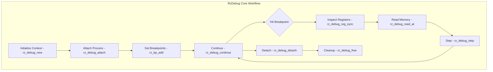

# RzDebug

The Rizin debugging library, `RzDebug`, provides comprehensive debugging capabilities including process attachment, breakpoint management, register inspection, and memory debugging. It supports multiple debugger backends for different operating systems and architectures.

The `RzDebug` structure manages debugging operations and coordinates communication with debugger backends.

## What can I expect here?

- Multi-backend debugging support:
  - **Native Debugging**: ptrace (Linux), WinDbg (Windows), lldb (macOS)
  - **GDB Protocol**: GDB remote serial protocol support
  - **Virtual Debugging**: In-memory debugging without live process
- Core functions for debugging lifecycle:
  - `rz_debug_new()`: To initialize a debug context
  - `rz_debug_attach()`: To attach to a process
  - `rz_debug_detach()`: To detach from process
  - `rz_debug_step()`: To single-step execution
  - `rz_debug_free()`: To release the debug context
- Breakpoint management:
  - Hardware breakpoints
  - Software breakpoints
  - Conditional breakpoints
  - Breakpoint callbacks
- Register inspection and modification:
  - Read/write individual registers
  - Register profile management
  - Architecture-specific register handling
- Memory operations:
  - Read/write target memory
  - Memory protection tracking
  - Stack frame inspection
- Watchpoint management:
  - Data read breakpoints
  - Data write breakpoints
- Stack and frame analysis

## Architecture

The debug library uses a modular backend architecture:

- **`RzDebug` Context**: Central debug state manager
- **Backend Plugins**: Platform and architecture-specific debuggers
- **Breakpoint Manager**: Tracks and manages breakpoints
- **Register Manager**: Handles processor registers
- **Memory Manager**: Manages target memory access

## RzDebug Core Workflow


## Key Structures

### RzDebug
Main debugging context containing:
- Backend reference
- Process/thread information
- Breakpoint list
- Register profile
- Memory maps
- Configuration

### RzBreakpoint
Represents a single breakpoint with:
- Address
- Type (hardware, software)
- Condition (optional)
- Callback function
- Enable/disable state

### RzRegItem
Individual register information:
- Register name
- Size in bits
- Type (integer, float, etc.)
- Flags
- Roles (PC, SP, FP, etc.)

## Supported Backends

### Linux
- **ptrace**: Native process debugging
- **GDB Protocol**: Remote GDB debugging

### Windows
- **WinDbg**: Native Windows debugging
- **GDB Protocol**: Remote debugging

### macOS
- **lldb**: Native debugger support
- **GDB Protocol**: Remote debugging

### Other Platforms
- **GDB Protocol**: Universal remote debugging support

## Usage Examples

### Example: Attaching to a Process

```c
#include <rz_debug.h>
#include <stdio.h>

int main(void) {
	// Create a debug context
	RzDebug *dbg = rz_debug_new(false);
	if (!dbg) {
		return 1;
	}

	// Attach to process with PID
	if (!rz_debug_attach(dbg, 1234)) {
		fprintf(stderr, "Failed to attach to process\n");
		rz_debug_free(dbg);
		return 1;
	}

	// Get process state
	RzDebugMap *map = rz_debug_map_get(dbg, dbg->reason);
	if (map) {
		printf("Attached to process at 0x%"PFMT64x"\n", map->addr);
	}

	// Detach from process
	rz_debug_detach(dbg, dbg->pid);

	// Cleanup
	rz_debug_free(dbg);
	return 0;
}
```

### Example: Setting and Managing Breakpoints

```c
RzDebug *dbg = rz_debug_new(false);
rz_debug_attach(dbg, 1234);

// Set a breakpoint at address 0x400000
RzBreakpoint *bp = rz_bp_new();
if (!rz_bp_add_sw(bp, dbg->bpnum++, 0x400000, 1, RZ_BP_PROT_EXEC)) {
	fprintf(stderr, "Failed to set breakpoint\n");
}

// List all breakpoints
void **it;
rz_pvector_foreach(bp->bps, it) {
	RzBreakpointItem *bpi = (RzBreakpointItem *)*it;
	printf("Breakpoint at 0x%"PFMT64x" (size: %d)\n",
		bpi->addr, bpi->size);
}

// Continue execution until next breakpoint
rz_debug_continue(dbg);

// Check debug stop reason
printf("Stop reason: %s\n", rz_debug_reason_to_string(dbg->reason));

// Cleanup
rz_bp_free(bp);
rz_debug_free(dbg);
```

### Example: Register Inspection

```c
RzDebug *dbg = rz_debug_new(false);
rz_debug_attach(dbg, 1234);

// Read all registers
rz_debug_reg_sync(dbg, RZ_REG_TYPE_ALL, false);

// Get register arena
RzReg *reg = dbg->reg;

// Read specific register value
ut64 rax = rz_reg_getv(reg, "rax");
printf("RAX = 0x%"PFMT64x"\n", rax);

// Read instruction pointer
ut64 rip = rz_reg_getv(reg, "rip");
printf("RIP = 0x%"PFMT64x"\n", rip);

// Get stack pointer
ut64 rsp = rz_reg_getv(reg, "rsp");
printf("RSP = 0x%"PFMT64x"\n", rsp);

// Modify a register
rz_reg_setv(reg, "rax", 0x12345678);
rz_debug_reg_sync(dbg, RZ_REG_TYPE_ALL, true);

rz_debug_detach(dbg, dbg->pid);
rz_debug_free(dbg);
```

### Example: Memory Reading

```c
RzDebug *dbg = rz_debug_new(false);
rz_debug_attach(dbg, 1234);

// Read memory at address
ut8 buffer[256];
int bytes_read = rz_debug_read_at(dbg, 0x400000, buffer, sizeof(buffer));

if (bytes_read > 0) {
	printf("Read %d bytes from 0x400000:\n", bytes_read);
	for (int i = 0; i < bytes_read && i < 16; i++) {
		printf("%02x ", buffer[i]);
	}
	printf("\n");
}

// Write memory at address
ut8 data[] = { 0x90, 0x90, 0x90, 0x90 }; // NOPs
rz_debug_write_at(dbg, 0x400010, data, sizeof(data));

rz_debug_detach(dbg, dbg->pid);
rz_debug_free(dbg);
```

## Key Features

- **Multi-platform Support**: Works on Linux, Windows, macOS
- **Multiple Backends**: Choose appropriate debugger for platform
- **Rich Breakpoint Support**: Hardware and software breakpoints
- **Register Management**: Access to all architecture registers
- **Memory Access**: Safe memory reading/writing
- **Stack Inspection**: Analyze call stacks and frames
- **Thread Support**: Multi-threaded process debugging
- **Signal Handling**: Manage process signals
- **Hot Patching**: Modify memory during execution

## Breakpoint Types

### Software Breakpoints
- Replaces instruction with breakpoint trap
- Slower but works everywhere
- Restores original instruction when hit

### Hardware Breakpoints
- Uses processor hardware breakpoint registers
- Faster, less intrusive
- Limited number available (varies by CPU)

### Conditional Breakpoints
- Breaks only when condition is true
- Condition evaluated at breakpoint hit
- Can reduce debugging noise

## Register Types

- **General Purpose**: Accumulators, data registers
- **Program Counter**: Instruction pointer (IP/PC)
- **Stack Pointer**: Stack top pointer (SP)
- **Base Pointer**: Frame base pointer (BP)
- **Floating Point**: FPU registers
- **SIMD**: SSE/AVX registers
- **Special Purpose**: Model-specific registers

## Debugging Workflow

1. **Attach** to target process
2. **Set Breakpoints** at strategic locations
3. **Continue** execution
4. **Inspect** registers and memory on breakpoint hit
5. **Step** through code
6. **Detach** when done

## Integration Points

- **RzCore**: High-level debugging commands
- **RzAnalysis**: Analyze debug information
- **RzReg**: Register management
- **RzBp**: Breakpoint handling
- **RzIO**: Memory access
