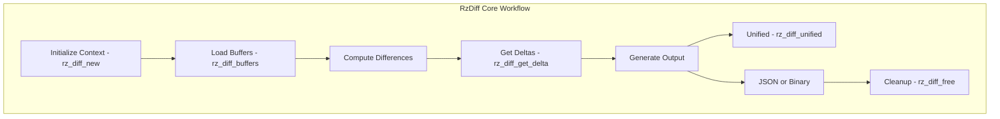

# RzDiff

The Rizin diff library, `RzDiff`, provides comprehensive diffing and comparison capabilities for binaries, text, and other data. It supports multiple diffing algorithms and output formats for analyzing differences between files or memory regions.

The `RzDiff` structure manages diffing operations and coordinates various diff engines and analysis techniques.

## What can I expect here?

- Multiple diffing algorithms:
  - **Unified Diff**: Standard unified diff format (similar to GNU diff)
  - **Binary Diff**: Byte-level binary comparison
  - **Function Diff**: Function-level semantic diffing
  - **Basic Diff**: Simple line/block comparison
- Core functions for diffing:
  - `rz_diff_new()`: To initialize a diff context
  - `rz_diff_buffers()`: To diff two buffers
  - `rz_diff_get_delta()`: To extract differences
  - `rz_diff_free()`: To release the diff context
- Output format support:
  - Unified diff format (human-readable)
  - Binary diff format (compact)
  - JSON output (for tools)
  - Colored diff output
- Advanced diffing features:
  - Fuzzy matching for slight variations
  - Byte-level granularity
  - Pattern-based comparison
  - Similarity scoring

## Architecture

The diff library uses a multi-engine architecture:

- **`RzDiff` Context**: Main diffing coordinator
- **Diff Engines**: Different algorithms for different use cases
- **Output Formatters**: Generate output in various formats
- **Similarity Analyzer**: Score and analyze differences

## RzDiff Core Workflow


## Key Structures

### RzDiff
Main diffing context containing:
- Buffer references
- Diff algorithm selection
- Configuration options
- Result storage

### RzDiffTuple
Represents a single difference:
- Type (add, remove, replace, equal)
- Address/offset
- Data bytes
- Size

## Supported Diff Types

### Unified Diff
Standard unified diff format with context lines:
```
--- original
+++ modified
@@ -1,3 +1,4 @@
 line 1
 line 2
+added line
 line 3
```

### Binary Diff
Low-level byte-by-byte differences suitable for binary data.

### Function Diff
High-level comparison of functions and basic blocks.

## Usage Examples

### Example: Comparing Two Buffers

```c
#include <rz_diff.h>
#include <stdio.h>

int main(void) {
	// Create diff context
	RzDiff *diff = rz_diff_new();
	if (!diff) {
		return 1;
	}

	// Original and modified data
	ut8 original[] = { 0x55, 0x89, 0xe5, 0x83, 0xec, 0x10 };
	ut8 modified[] = { 0x55, 0x89, 0xe5, 0x83, 0xec, 0x20 };

	// Perform diff
	int result = rz_diff_buffers(diff, original, sizeof(original),
	                              modified, sizeof(modified), 0);

	if (result > 0) {
		printf("Found %d differences\n", result);

		// Get differences
		RzDiffTuple *tuple;
		while ((tuple = rz_diff_get_next(diff))) {
			printf("Offset: 0x%"PFMT64x" - ", tuple->off_a);
			
			if (tuple->type == RZ_DIFF_TYPE_REMOVE) {
				printf("Removed ");
			} else if (tuple->type == RZ_DIFF_TYPE_ADD) {
				printf("Added ");
			} else {
				printf("Changed ");
			}
			
			printf("%d bytes\n", tuple->len_a);
		}
	}

	// Cleanup
	rz_diff_free(diff);
	return 0;
}
```

### Example: File Diffing

```c
#include <rz_diff.h>
#include <rz_util.h>

int main(void) {
	// Read files
	ut8 *file1 = NULL, *file2 = NULL;
	int size1 = rz_file_slurp("/path/to/binary1", &file1);
	int size2 = rz_file_slurp("/path/to/binary2", &file2);

	if (size1 <= 0 || size2 <= 0) {
		fprintf(stderr, "Failed to read files\n");
		return 1;
	}

	// Create diff context
	RzDiff *diff = rz_diff_new();

	// Perform diff
	rz_diff_buffers(diff, file1, size1, file2, size2, 0);

	// Print unified diff format
	char *output = rz_diff_unified(diff, "file1", "file2");
	if (output) {
		printf("%s", output);
		free(output);
	}

	// Cleanup
	rz_diff_free(diff);
	free(file1);
	free(file2);
	return 0;
}
```

### Example: Binary Section Comparison

```c
RzDiff *diff = rz_diff_new();

// Get .text sections from two binaries
RzBinSection *sec1 = get_section(bin1, ".text");
RzBinSection *sec2 = get_section(bin2, ".text");

// Compare sections
ut8 *data1 = read_section(bin1, sec1);
ut8 *data2 = read_section(bin2, sec2);

rz_diff_buffers(diff, data1, sec1->size, data2, sec2->size, 0);

// Generate similarity score
float similarity = rz_diff_similarity(diff);
printf("Sections are %.1f%% similar\n", similarity * 100);

rz_diff_free(diff);
free(data1);
free(data2);
```

## Output Formats

### Text Diff
Human-readable format with context:
```
Offset 0x00: 0x10 -> 0x20
Offset 0x05: removed 4 bytes
Offset 0x10: inserted "new data"
```

### Unified Format
Standard unified diff suitable for patches:
```
--- binary1.bin
+++ binary2.bin
@@ -1,8 +1,8 @@
 00 00 00 00
-55 89 e5 83
+55 89 e5 23
 ec 10 83 c4
```

### JSON Format
Machine-readable format for tool integration:
```json
{
  "type": "diff",
  "hunks": [
    {
      "offset": 5,
      "removed": "55 89 e5 83",
      "added": "55 89 e5 23"
    }
  ]
}
```

## Key Features

- **Multi-algorithm Support**: Choose algorithm for use case
- **Flexible Granularity**: Byte, line, or function level
- **Format Support**: Multiple output formats
- **Similarity Scoring**: Measure how similar files are
- **Fuzzy Matching**: Handle slight variations
- **Performance**: Efficient diffing even for large files
- **Colored Output**: Visual diff in terminal

## Diff Types

### Additive
New data inserted in modified version.

### Removals
Data deleted from original version.

### Replacements
Data modified between versions.

### Equal
Sections identical between versions.

## Use Cases

1. **Binary Patching**: Generate patches for binary updates
2. **Version Comparison**: Compare different versions of binaries
3. **Malware Analysis**: Detect changes between samples
4. **Code Review**: Identify changes in compiled code
5. **Regression Testing**: Detect unexpected changes
6. **Build Verification**: Verify deterministic builds

## Performance Considerations

- Large buffer sizes may need incremental processing
- Streaming diff for very large files
- Caching for repeated comparisons
- Similarity scoring trades accuracy for speed

## Integration Points

- **RzCore**: High-level diffing commands
- **RzBin**: Compare binary sections
- **RzAnalysis**: Semantic function comparison
