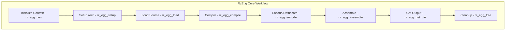

# RzEgg

The Rizin egg library, `RzEgg`, is a polymorphic code generator that produces executable shellcode from high-level descriptions. It provides functionality for generating position-independent code, encoding/obfuscation, and polymorph transformations suitable for exploit development and security research.

The `RzEgg` structure manages code generation with support for multiple architectures and output formats.

## What can I expect here?

- Shellcode generation and compilation:
  - Position-independent code (PIC)
  - Architecture-specific optimizations
  - Output format selection (binary, hex, C code)
- High-level shellcode description language:
  - Assembly-like syntax
  - Code templates
  - Macro expansion
- Polymorphic code generation:
  - Automatic code transformation
  - Obfuscation techniques
  - Multiple code variants
- Encoding and obfuscation:
  - XOR encoding with various modes
  - Byte replacement
  - Instruction reordering
  - Junk instruction insertion
- Core functions for egg lifecycle:
  - `rz_egg_new()`: To initialize an egg context
  - `rz_egg_load()`: To load shellcode descriptions
  - `rz_egg_compile()`: To compile code
  - `rz_egg_assemble()`: To assemble to binary
  - `rz_egg_free()`: To release the egg context
- Multiple architecture support:
  - x86/x86_64
  - ARM/ARM64
  - MIPS
  - PowerPC

## Architecture

The egg library uses a multi-stage compilation architecture:

- **`RzEgg` Context**: Main code generation manager
- **Parser**: Parse high-level shellcode descriptions
- **Compiler**: Compile to intermediate representation
- **Optimizer**: Optimize generated code
- **Assembler**: Assemble to binary output
- **Encoder**: Apply encoding/obfuscation

## RzEgg Core Workflow


## Key Structures

### RzEgg
Main code generation context containing:
- Architecture and platform information
- Compiled code buffer
- Encoder plugins
- Configuration options

### RzEggEmit
Handles emission of code for specific architecture.

## Shellcode Language

Simple assembly-like language for describing shellcode:

```egg
; Simple exit shellcode (x86-64 Linux)
mov eax, 60      ; exit syscall
xor edi, edi     ; status = 0
syscall
```

## Usage Examples

### Example: Generating Simple Shellcode

```c
#include <rz_egg.h>
#include <stdio.h>

int main(void) {
	// Create egg context for x86-64
	RzEgg *egg = rz_egg_new();
	if (!egg) {
		return 1;
	}

	// Set target architecture
	rz_egg_setup(egg, "x86", 64, 0, 0);

	// Simple shellcode source
	const char *source = 
		"syscall 60 0"  // exit(0) on Linux
		"nop nop nop";

	// Load and compile
	if (!rz_egg_load(egg, source, 0)) {
		fprintf(stderr, "Failed to load shellcode\n");
		rz_egg_free(egg);
		return 1;
	}

	// Compile to machine code
	if (!rz_egg_compile(egg)) {
		fprintf(stderr, "Failed to compile\n");
		rz_egg_free(egg);
		return 1;
	}

	// Get binary output
	RzBuffer *output = rz_egg_get_bin(egg);
	if (output) {
		ut8 *bytes = (ut8 *)rz_buf_get_at(output, 0, NULL);
		int size = rz_buf_size(output);

		printf("Generated %d bytes of shellcode:\n", size);
		for (int i = 0; i < size; i++) {
			printf("\\x%02x", bytes[i]);
		}
		printf("\n");
	}

	// Cleanup
	rz_egg_free(egg);
	return 0;
}
```

### Example: Using Encoding/Obfuscation

```c
RzEgg *egg = rz_egg_new();
rz_egg_setup(egg, "x86", 32, 0, 0);

const char *shellcode = "..."; // Your shellcode

rz_egg_load(egg, shellcode, 0);
rz_egg_compile(egg);

// Apply XOR encoding
rz_egg_encode(egg, "xor");  // or other encoders

// Get obfuscated output
RzBuffer *encoded = rz_egg_get_bin(egg);

rz_egg_free(egg);
```

### Example: Generating Polymorphic Variants

```c
RzEgg *egg = rz_egg_new();
rz_egg_setup(egg, "x86", 32, 0, 0);

// Load base shellcode
rz_egg_load(egg, shellcode_source, 0);

// Generate multiple polymorphic variants
for (int i = 0; i < 5; i++) {
	rz_egg_compile(egg);
	
	// Apply different transformations
	switch (i % 3) {
		case 0:
			rz_egg_encode(egg, "xor");
			break;
		case 1:
			rz_egg_encode(egg, "rol");  // ROL encoding
			break;
		case 2:
			rz_egg_encode(egg, "jmp");  // JMP obfuscation
			break;
	}
	
	// Save variant
	char filename[32];
	snprintf(filename, sizeof(filename), "payload_%d.bin", i);
	save_shellcode(filename, rz_egg_get_bin(egg));
}

rz_egg_free(egg);
```

## Shellcode Templates

### exec() syscall (x86-64 Linux)
```egg
push 0
push string:"/bin/sh"
push 0
mov rax, 59      ; execve
syscall
```

### Read file (x86-64 Linux)
```egg
mov rax, 2       ; open
mov rdi, string:"/etc/passwd"
xor rsi, rsi
syscall

mov rdi, rax     ; fd
mov rax, 0       ; read
mov rsi, rbx     ; buffer
mov rdx, 100     ; size
syscall
```

## Encoding Methods

### XOR Encoding
Simple XOR with single or multi-byte key.

### ROL/ROR
Rotate left/right encoding with variable rotation counts.

### ADD/SUB
Addition/subtraction encoding.

### JMP Obfuscation
Interleave code with JMP instructions to break linear flow.

### Junk Code
Insert non-functional code to increase entropy.

## Key Features

- **Multi-architecture**: Generate for various CPU architectures
- **Position-Independent**: Code works anywhere in memory
- **Polymorphic**: Generate different variants automatically
- **Compact Output**: Optimized for size constraints
- **Format Selection**: Choose output format (binary, hex, C)
- **Encoding**: Built-in encoding and obfuscation
- **Template Library**: Pre-built common shellcode templates
- **Cross-platform**: Works with different OSes

## Output Formats

### Binary
Raw machine code suitable for injection.

### Hexadecimal
Human-readable hex representation.

### C Code
Generated C code for inclusion in programs:
```c
unsigned char shellcode[] = {
	0x90, 0x90, 0x90, ...
};
```

### Assembly
Generated assembly source code.

## Polymorphism Techniques

1. **Register Substitution**: Use different registers
2. **Instruction Reordering**: Change instruction order
3. **Junk Insertion**: Add non-functional code
4. **Encoding**: XOR or other encoding schemes
5. **Code Rewriting**: Semantically equivalent instructions

## Use Cases

- **Exploit Development**: Generate payloads for exploits
- **Security Testing**: Create test payloads
- **Reverse Engineering**: Study code transformations
- **Anti-analysis**: Obfuscate detection signatures
- **Payload Generation**: Build custom shellcode

## Integration Points

- **RzAsm**: Assemble shellcode
- **RzCore**: High-level egg commands
- **RzIO**: Test generated payloads

## Performance Considerations

- Encoding adds size and execution overhead
- Polymorphism trades uniqueness for file size
- Template selection affects compression
