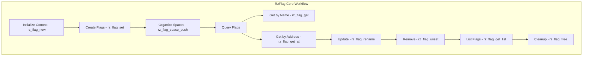

# RzFlag

The Rizin flag library, `RzFlag`, manages flags, bookmarks, and labels within the reverse-engineering session. Flags provide a way to annotate important locations and mark regions of interest in analyzed binaries.

The `RzFlag` structure maintains a hierarchical namespace of flags with support for spaces, ordering, and efficient lookup.

## What can I expect here?

- Flag management and organization:
  - Create, delete, rename flags
  - Hierarchical namespace support
  - Flag spaces for organization
- Bookmark support:
  - Mark important addresses
  - Persistent flag storage
  - Quick navigation
- Core functions for flag lifecycle:
  - `rz_flag_new()`: To initialize a flag context
  - `rz_flag_set()`: To create/set a flag
  - `rz_flag_get()`: To retrieve flag information
  - `rz_flag_unset()`: To remove a flag
  - `rz_flag_free()`: To release the flag context
- Flag space management:
  - Organize flags into separate namespaces
  - Switch between flag spaces
  - Import/export flag spaces
- Advanced features:
  - Flag ranges (covering multiple bytes)
  - Flag colors for visualization
  - Flag comments/descriptions
  - Fast address-to-flag lookup

## Architecture

The flag system uses a tree-based data structure for efficient lookup:

- **`RzFlag` Context**: Main flag manager
- **Flag Tree**: Hierarchical storage of flags
- **Flag Spaces**: Separate namespaces for flag organization
- **RzFlagItem**: Individual flag entries

## RzFlag Core Workflow


## Key Structures

### RzFlag
Main flag context containing:
- Flag tree indexed by name
- Flag tree indexed by address
- Flag spaces collection
- Configuration

### RzFlagItem
Individual flag with:
- Name
- Address
- Size (range)
- Space assignment
- Color
- Comment

### RzFlagSpace
Namespace container for organizing flags.

## Flag Naming Conventions

Flags typically follow naming conventions:
- **Symbols**: `sym.`, `sym.imp.` (imports)
- **Sections**: `section.` (binary sections)
- **Functions**: `fcn.` or `func.`
- **Strings**: `str.` (string locations)
- **Marks**: `mark.`, `bookmark.`
- **Custom**: User-defined flags

## Usage Examples

### Example: Creating and Managing Flags

```c
#include <rz_flag.h>
#include <stdio.h>

int main(void) {
	// Create flag context
	RzFlag *flag = rz_flag_new();
	if (!flag) {
		return 1;
	}

	// Set a flag at an address
	rz_flag_set(flag, "my_function", 0x1000, 100);
	printf("Set flag 'my_function' at 0x1000 (size: 100)\n");

	// Set another flag
	rz_flag_set(flag, "loop_start", 0x1010, 0);

	// Retrieve flag information
	RzFlagItem *item = rz_flag_get(flag, "my_function");
	if (item) {
		printf("Flag: %s @ 0x%"PFMT64x" (size: %"PFMT64u")\n",
			item->name, item->offset, item->size);
	}

	// Get flag at specific address
	item = rz_flag_get_at(flag, 0x1000, true);
	if (item) {
		printf("Flag at 0x1000: %s\n", item->name);
	}

	// Rename a flag
	rz_flag_rename(flag, "my_function", "important_func");

	// Unset (remove) a flag
	rz_flag_unset(flag, "loop_start");

	// Cleanup
	rz_flag_free(flag);
	return 0;
}
```

### Example: Flag Spaces

```c
RzFlag *flag = rz_flag_new();

// Create flag spaces
rz_flag_space_push(flag, "functions");
rz_flag_set(flag, "func1", 0x1000, 0);
rz_flag_set(flag, "func2", 0x2000, 0);

// Switch to different space
rz_flag_space_push(flag, "strings");
rz_flag_set(flag, "str1", 0x3000, 32);
rz_flag_set(flag, "str2", 0x3020, 24);

// List flags in current space
RzFlagList *list = rz_flag_get_list(flag, "");
void **it;
rz_list_foreach(list, it) {
	RzFlagItem *item = (RzFlagItem *)*it;
	printf("%s @ 0x%"PFMT64x"\n", item->name, item->offset);
}

rz_flag_free(flag);
```

### Example: Iterating Over Flags

```c
RzFlag *flag = rz_flag_new();

// Add some flags
rz_flag_set(flag, "start", 0x1000, 0);
rz_flag_set(flag, "middle", 0x2000, 0);
rz_flag_set(flag, "end", 0x3000, 0);

// Iterate through all flags in default space
RzFlagList *list = rz_flag_get_list(flag, "");
void **it;
rz_list_foreach(list, it) {
	RzFlagItem *item = (RzFlagItem *)*it;
	printf("Flag: %-20s @ 0x%08"PFMT64x"\n", item->name, item->offset);
}

rz_flag_free(flag);
```

### Example: Flag Ranges

```c
RzFlag *flag = rz_flag_new();

// Set a flag with a range (covers 0x1000 to 0x1100)
rz_flag_set(flag, "code_section", 0x1000, 0x100);

// Check if address is within flag range
RzFlagItem *item = rz_flag_get_at(flag, 0x1050, false);
if (item) {
	printf("Address 0x1050 is in flag '%s'\n", item->name);
}

rz_flag_free(flag);
```

## Common Flag Patterns

### Symbol Flags
- `sym.main`: Main function
- `sym.printf`: Imported printf function
- `sym.imp.libc.so.6`: Import from library

### Section Flags
- `section.text`: Code section
- `section.data`: Data section
- `section.rodata`: Read-only data section

### Function Flags
- `fcn.0x1000`: Function at address 0x1000
- `fcn.important`: Named function

### String Flags
- `str.hello_world`: String location
- `str.format_string`: Format string location

### Bookmark Flags
- `mark.todo`: Bookmark for later
- `bookmark.important`: Important location

## Key Features

- **Fast Lookup**: O(log n) address-to-flag lookup
- **Hierarchical Organization**: Flag spaces for organization
- **Size Support**: Flags can cover ranges
- **Renaming**: Easy flag renaming with update
- **Searching**: Pattern matching on flag names
- **Export/Import**: Save and restore flag sets
- **Color Support**: Visual organization with colors
- **Comments**: Attach descriptions to flags

## Flag Operations

### Create
Add new flag at address.

### Delete
Remove flag by name.

### Rename
Change flag name while preserving metadata.

### Update
Modify flag properties (address, size).

### Search
Find flags by name or address range.

## Integration Points

- **RzCore**: High-level flag commands (`f`, `fs`, `fl`)
- **RzAnalysis**: Auto-generated function and symbol flags
- **RzBin**: Import flags from binary symbols
- **Commands**: Display flags in disassembly

## Persistence

Flags can be saved and loaded:
- Save to file
- Load from file
- Export to various formats

## Performance Considerations

- Tree-based storage provides logarithmic lookup
- Fast iteration over all flags
- Efficient address range queries
- Minimal memory overhead per flag
