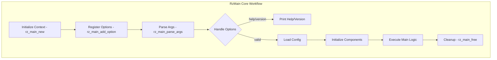

# RzMain

The Rizin main library, `RzMain`, provides the main entry point and command-line interface utilities for Rizin-based applications. It handles command-line parsing, application initialization, and high-level program flow management.

The `RzMain` structure coordinates initialization, configuration, and execution of Rizin tools.

## What can I expect here?

- Command-line interface utilities:
  - Command-line argument parsing
  - Option handling and validation
  - Help and usage message generation
- Application lifecycle management:
  - Initialization routines
  - Cleanup and shutdown
  - Signal handling
- Core functions:
  - `rz_main_new()`: Create main context
  - `rz_main_parse_args()`: Parse command-line arguments
  - `rz_main_run()`: Execute main application
  - `rz_main_free()`: Release main context
- Common utilities:
  - Configuration file loading
  - Environment variable handling
  - User home directory management
- Tool implementations:
  - `rizin`: Main reverse engineering tool
  - `rz-bin`: Binary analysis tool
  - `rz-asm`: Assembler/disassembler
  - `rz-hex`: Hexadecimal utilities
  - `rz-find`: Pattern finder
  - And others...

## Architecture

The main library provides utilities for tool development:

- **`RzMain` Context**: Application state manager
- **Argument Parser**: Parse command-line options
- **Configuration Manager**: Manage app configuration
- **Error Handler**: Handle errors and signals
- **Logger**: Application logging

## RzMain Core Workflow


## Key Structures

### RzMain
Main application context containing:
- Application name
- Version information
- Configuration
- Loaded plugins
- Output streams

### RzMainOption
Command-line option definition with:
- Short flag
- Long name
- Description
- Value type
- Default value

## Command-Line Tool Implementations

### rizin
Main reverse engineering console:
```bash
rizin [options] file
```

### rz-bin
Binary information extraction:
```bash
rz-bin -l file          # List sections
rz-bin -s file          # List symbols
rz-bin -i file          # Binary info
```

### rz-asm
Assembly and disassembly:
```bash
rz-asm -a x86 -b 32 "mov eax, 1"   # Assemble
rz-asm -d -a x86 -b 32 "\x89\xc8"  # Disassemble
```

### rz-hex
Hexadecimal utilities:
```bash
rz-hex -d "48656c6c6f"              # Decode hex
rz-hex -e "Hello"                   # Encode hex
```

### rz-find
Pattern search:
```bash
rz-find -x "55 89 e5" file          # Find pattern
rz-find -s "string" file            # Find string
```

## Usage Examples

### Example: Basic Command-Line Application

```c
#include <rz_main.h>
#include <stdio.h>

int main(int argc, const char *argv[]) {
	// Create main context
	RzMain *main = rz_main_new(argv[0]);
	if (!main) {
		return 1;
	}

	// Register command-line options
	rz_main_add_option(main, "help", "h", 
		"Show help message", NULL);
	rz_main_add_option(main, "version", "v",
		"Show version", NULL);
	rz_main_add_option(main, "output", "o",
		"Output file", "file");

	// Parse arguments
	if (!rz_main_parse_args(main, argc, argv)) {
		rz_main_print_help(main);
		rz_main_free(main);
		return 1;
	}

	// Handle options
	if (rz_main_has_option(main, "help")) {
		rz_main_print_help(main);
		rz_main_free(main);
		return 0;
	}

	if (rz_main_has_option(main, "version")) {
		printf("Version 1.0.0\n");
		rz_main_free(main);
		return 0;
	}

	// Get input file
	const char *input_file = rz_main_get_positional(main, 0);
	if (!input_file) {
		fprintf(stderr, "No input file specified\n");
		rz_main_free(main);
		return 1;
	}

	// Do work with input file...
	printf("Processing: %s\n", input_file);

	// Cleanup
	rz_main_free(main);
	return 0;
}
```

### Example: Tool with Configuration

```c
RzMain *main = rz_main_new("mytool");

// Set application metadata
rz_main_set_version(main, "1.2.3");
rz_main_set_description(main, "My analysis tool");

// Add options
rz_main_add_option(main, "verbose", "v",
	"Verbose output", NULL);
rz_main_add_option(main, "quiet", "q",
	"Quiet mode", NULL);
rz_main_add_option(main, "config", "c",
	"Configuration file", "file");

// Parse arguments
rz_main_parse_args(main, argc, argv);

// Get configuration
if (rz_main_has_option(main, "config")) {
	const char *config_file = rz_main_get_option(main, "config");
	load_config(config_file);
}

rz_main_free(main);
```

## Common Tools Usage

### rizin - Main Interactive Console

```bash
# Open binary
rizin /usr/bin/ls

# Common commands
[0x00000000]> i          # Binary info
[0x00000000]> aa         # Analyze
[0x00000000]> afl        # List functions
[0x00000000]> pdf        # Print function disassembly
```

### rz-bin - Binary Analysis

```bash
# Get all information
rz-bin -A /usr/bin/ls

# List specific information
rz-bin -s /usr/bin/ls    # Symbols
rz-bin -S /usr/bin/ls    # Sections
rz-bin -i /usr/bin/ls    # Info
```

### rz-asm - Assemble/Disassemble

```bash
# Assemble
rz-asm -a x86 -b 32 "mov eax, 1"

# Disassemble
echo -n "558945" | rz-asm -d -a x86 -b 32

# With offset
rz-asm -a x86 -b 64 -o 0x400000 -d file.bin
```

## Key Features

- **Modular Tool Development**: Framework for creating tools
- **Consistent Interface**: Standard command-line handling
- **Error Management**: Proper error handling and reporting
- **Help System**: Automatic help generation
- **Configuration**: Loading and managing configuration
- **Plugins**: Support for plugin-based extensions
- **Signal Handling**: Graceful signal handling
- **Environment**: Environment variable support

## Command-Line Pattern

Most Rizin tools follow this pattern:
1. Parse command-line arguments
2. Validate options
3. Initialize components
4. Execute main logic
5. Handle errors
6. Cleanup and exit

## Integration Points

- **RzCore**: Execute Rizin commands
- **RzConfig**: Application configuration
- **RzCons**: Console output
- **Plugins**: Load tool-specific plugins

## Exit Codes

Standard exit codes:
- **0**: Success
- **1**: General error
- **2**: Command-line syntax error
- **3**: Configuration error

## Environment Variables

Common environment variables:
- **RZ_HOME**: Rizin home directory
- **RZ_CONFIG**: Configuration file path
- **RZ_DEBUG**: Debug mode flag
- **RZ_PLUGINS**: Custom plugin path

## Common Options

Most tools support:
- `-h, --help`: Show help
- `-v, --version`: Show version
- `-q, --quiet`: Quiet mode
- `-V, --verbose`: Verbose mode
- `-e, --eval`: Evaluate expression

## Use Cases

- **Tool Development**: Create Rizin-based tools
- **Automation**: Batch processing scripts
- **Integration**: Integrate with other systems
- **Utilities**: Create specialized analysis tools
