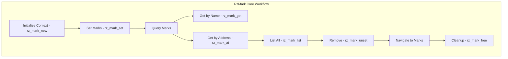

# RzMark

The Rizin mark library, `RzMark`, provides functionality for creating and managing bookmarks and temporary marks within an analysis session. Marks enable users to annotate interesting locations and maintain context during interactive analysis.

The `RzMark` structure manages temporary bookmarks and session markers.

## What can I expect here?

- Bookmark and mark management:
  - Create temporary marks
  - Mark visibility and organization
  - Mark persistence within session
- Core functions for marks:
  - `rz_mark_new()`: Create a new mark
  - `rz_mark_at()`: Get mark at address
  - `rz_mark_set()`: Set mark at location
  - `rz_mark_unset()`: Remove mark
  - `rz_mark_list()`: List all marks
  - `rz_mark_free()`: Release mark context
- Mark types:
  - Bookmarks for important locations
  - Temporary marks for quick notes
  - Analysis checkpoints
  - Debugging breakpoints reference
- Advanced features:
  - Mark descriptions and comments
  - Mark colors for categorization
  - Mark persistence options
  - Quick mark navigation

## Architecture

The mark system provides lightweight bookmarking:

- **`RzMark` Context**: Mark manager
- **Mark Collection**: Organized mark storage
- **Mark Navigation**: Quick access to marks
- **Mark Display**: Visual mark representation

## RzMark Core Workflow


## Key Structures

### RzMark
Individual mark containing:
- Address
- Description
- Color
- Type
- Timestamp

## Mark Types

### Bookmarks
Persistent marks for important locations.

### Temporary Marks
Quick marks for current analysis session.

### Analysis Checkpoints
Marks representing analysis state.

### Notes
Marks with attached descriptions.

## Usage Examples

### Example: Creating and Managing Marks

```c
#include <rz_mark.h>
#include <stdio.h>

int main(void) {
	// Create mark context
	RzMark *mark = rz_mark_new();
	if (!mark) {
		return 1;
	}

	// Set a mark at important address
	rz_mark_set(mark, "interesting_function", 0x1000, 0);
	printf("Set mark at 0x1000\n");

	// Add another mark with description
	rz_mark_set(mark, "suspicious_code", 0x2000, 0);

	// Retrieve mark
	RzMarkItem *item = rz_mark_get(mark, "interesting_function");
	if (item) {
		printf("Mark '%s' at 0x%"PFMT64x"\n", item->name, item->addr);
	}

	// Get mark at specific address
	item = rz_mark_at(mark, 0x1000);
	if (item) {
		printf("Found mark at 0x1000: %s\n", item->name);
	}

	// List all marks
	RzList *marks = rz_mark_list(mark);
	void **it;
	rz_list_foreach(marks, it) {
		RzMarkItem *m = (RzMarkItem *)*it;
		printf("Mark: %-30s @ 0x%"PFMT64x"\n", m->name, m->addr);
	}

	// Remove mark
	rz_mark_unset(mark, "suspicious_code");

	// Cleanup
	rz_mark_free(mark);
	return 0;
}
```

### Example: Mark Categorization

```c
RzMark *mark = rz_mark_new();

// Create marks for different analysis stages
rz_mark_set(mark, "entry_point", 0x1000, 0);
rz_mark_set(mark, "main_function", 0x2000, 0);
rz_mark_set(mark, "library_call", 0x3000, 0);
rz_mark_set(mark, "suspicious_syscall", 0x4000, 0);
rz_mark_set(mark, "return_address", 0x5000, 0);

// Retrieve marks by category
RzList *important = rz_mark_list(mark);

void **it;
rz_list_foreach(important, it) {
	RzMarkItem *m = (RzMarkItem *)*it;
	printf("%-25s @ 0x%"PFMT64x"\n", m->name, m->addr);
}

rz_mark_free(mark);
```

### Example: Quick Navigation

```c
RzMark *mark = rz_mark_new();

// Set bookmarks for quick navigation
rz_mark_set(mark, "00_start", 0x400000, 0);
rz_mark_set(mark, "10_main", 0x401000, 0);
rz_mark_set(mark, "20_parsing", 0x402000, 0);
rz_mark_set(mark, "30_validation", 0x403000, 0);

// Jump to specific mark
const char *jump_to = "20_parsing";
RzMarkItem *target = rz_mark_get(mark, jump_to);
if (target) {
	printf("Jumping to %s @ 0x%"PFMT64x"\n", jump_to, target->addr);
	// Navigate to target->addr
}

rz_mark_free(mark);
```

## Mark Naming Conventions

Recommended naming patterns:
- **Location-based**: `entry`, `main_loop`, `exit_handler`
- **Function-based**: `check_auth`, `validate_input`, `parse_data`
- **Numbered**: `00_init`, `10_parse`, `20_analyze`
- **Issue-based**: `bug_1`, `todo_2`, `hack_3`
- **Pattern-based**: `crypto_block`, `network_io`, `file_access`

## Key Features

- **Lightweight**: Minimal overhead per mark
- **Fast Access**: Quick lookup of marks
- **Organized**: Support mark organization
- **Descriptive**: Attach information to marks
- **Visible**: Visual representation in disassembly
- **Persistent**: Maintain during session

## Mark Operations

### Create
Set a new mark at address.

### Retrieve
Get mark information.

### Delete
Remove a mark.

### List
Enumerate all marks.

### Search
Find marks by name or address.

## Integration with Analysis

Marks integrate with other Rizin components:
- Track analysis progress
- Mark suspicious code sections
- Note important addresses
- Remember debugging locations

## Difference from Flags

| Aspect | Mark | Flag |
|--------|------|------|
| Scope | Session | Persistent |
| Type | Temporary bookmark | Named label |
| Use Case | Quick annotation | Permanent naming |
| Storage | Memory | File |

## Performance Considerations

- O(1) address lookup
- O(log n) name lookup
- Minimal memory per mark
- Efficient iteration

## Use Cases

1. **Analysis Progress**: Mark analysis milestones
2. **Bug Tracking**: Mark suspicious locations
3. **Code Review**: Note interesting sections
4. **Debugging**: Track execution points
5. **Quick Navigation**: Jump between important locations

## Session-based vs Persistent

### Session Marks
- Temporary during analysis
- Lost when session ends
- Quick annotations

### Persistent Flags
- Saved with project
- Reusable across sessions
- Formal naming

## Integration Points

- **RzCore**: Mark management commands
- **RzFlag**: Similar functionality with persistence
- **RzAnalysis**: Track analysis progress
- **Console**: Display marks in disassembly

## Best Practices

1. Use descriptive mark names
2. Organize marks by category
3. Clean up unused marks
4. Use flags for permanent labels
5. Use marks for temporary notes
