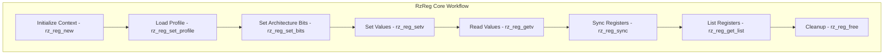

# RzReg

The Rizin register library, `RzReg`, provides comprehensive register management and profiling functionality for different architectures and platforms. It manages register definitions, values, and architecture-specific register behaviors.

The `RzReg` structure maintains register information and state across different processor architectures.

## What can I expect here?

- Register profile management:
  - Architecture-specific register definitions
  - Register type and size information
  - Register naming and aliases
- Register value management:
  - Read/write register values
  - Register value validation
  - Arena-based value storage
- Core functions for registers:
  - `rz_reg_new()`: Create register context
  - `rz_reg_set_profile()`: Load architecture profile
  - `rz_reg_getv()`: Get register value
  - `rz_reg_setv()`: Set register value
  - `rz_reg_free()`: Release register context
- Register types:
  - General purpose registers
  - Special purpose registers (PC, SP, BP)
  - Floating point registers
  - SIMD registers (SSE, AVX)
  - Control registers
  - Model-specific registers
- Advanced features:
  - Register profiles for different platforms
  - Register aliases and alternative names
  - Register value arenas
  - Register change tracking

## Architecture

The register system uses profile-based architecture:

- **`RzReg` Context**: Main register manager
- **Register Profiles**: Architecture definitions
- **Register Items**: Individual register information
- **Register Arenas**: Value storage for register state

## RzReg Core Workflow


## Key Structures

### RzReg
Main register context containing:
- Current architecture
- Register item collection
- Register arenas
- Value storage

### RzRegItem
Individual register definition with:
- Register name
- Size in bits
- Type (general, special, float, etc.)
- Flags
- Parent register (for sub-registers)
- Roles (PC, SP, FP, etc.)

### RzRegArena
Value storage for registers:
- Arena buffer
- Register values
- Size information

## Supported Register Types

### General Purpose (x86-64)
- RAX, RBX, RCX, RDX
- RSI, RDI, RBP, RSP
- R8 through R15

### Floating Point
- FP0 through FP7 (x87)
- XMM0 through XMM15 (SSE)
- YMM0 through YMM15 (AVX)
- ZMM0 through ZMM31 (AVX-512)

### Special Purpose
- RIP: Instruction pointer
- RSP: Stack pointer
- RBP: Base pointer

### ARM Registers
- R0 through R15 (general purpose)
- FP, SP, LR, PC (special)

### MIPS Registers
- $0 through $31 (general purpose)
- Special registers (HI, LO, etc.)

## Usage Examples

### Example: Getting and Setting Register Values

```c
#include <rz_reg.h>
#include <stdio.h>

int main(void) {
	// Create register context
	RzReg *reg = rz_reg_new();
	if (!reg) {
		return 1;
	}

	// Set architecture profile (x86-64)
	if (!rz_reg_set_profile(reg, "x86")) {
		fprintf(stderr, "Failed to load x86 profile\n");
		rz_reg_free(reg);
		return 1;
	}

	// Set 64-bit mode
	rz_reg_set_bits(reg, 64);

	// Set register values
	rz_reg_setv(reg, "rax", 0x12345678);
	rz_reg_setv(reg, "rbx", 0x87654321);

	// Read register values
	ut64 rax = rz_reg_getv(reg, "rax");
	ut64 rbx = rz_reg_getv(reg, "rbx");

	printf("RAX = 0x%"PFMT64x"\n", rax);
	printf("RBX = 0x%"PFMT64x"\n", rbx);

	// Cleanup
	rz_reg_free(reg);
	return 0;
}
```

### Example: Iterating Through Registers

```c
RzReg *reg = rz_reg_new();
rz_reg_set_profile(reg, "x86");
rz_reg_set_bits(reg, 64);

// List all registers
RzList *registers = rz_reg_get_list(reg, RZ_REG_TYPE_ALL);
void **it;
rz_list_foreach(registers, it) {
	RzRegItem *item = (RzRegItem *)*it;
	printf("Register: %-10s Size: %d bits\n", item->name, item->size);
}

rz_reg_free(reg);
```

### Example: Register Profiles

```c
RzReg *reg = rz_reg_new();

// Load different architecture profiles
const char *architectures[] = {
	"x86",      // x86-64
	"arm",      // ARM
	"mips",     // MIPS
	"ppc",      // PowerPC
	"riscv",    // RISC-V
	NULL
};

for (int i = 0; architectures[i]; i++) {
	rz_reg_set_profile(reg, architectures[i]);
	
	// Get register list
	RzList *regs = rz_reg_get_list(reg, RZ_REG_TYPE_ALL);
	printf("%s: %d registers\n", architectures[i], rz_list_length(regs));
}

rz_reg_free(reg);
```

### Example: Special Register Access

```c
RzReg *reg = rz_reg_new();
rz_reg_set_profile(reg, "x86");
rz_reg_set_bits(reg, 64);

// Set instruction pointer (PC)
rz_reg_setv(reg, "rip", 0x400000);

// Set stack pointer
rz_reg_setv(reg, "rsp", 0x7fff0000);

// Set base pointer
rz_reg_setv(reg, "rbp", 0x7fff0000);

// Read special registers
ut64 pc = rz_reg_getv(reg, "rip");
ut64 sp = rz_reg_getv(reg, "rsp");
ut64 bp = rz_reg_getv(reg, "rbp");

printf("PC (RIP) = 0x%"PFMT64x"\n", pc);
printf("SP (RSP) = 0x%"PFMT64x"\n", sp);
printf("BP (RBP) = 0x%"PFMT64x"\n", bp);

rz_reg_free(reg);
```

## Register Types

### General Purpose
Standard computation registers.

### Floating Point
For floating-point arithmetic.

### SIMD
Single Instruction Multiple Data registers.

### Special Purpose
Program counter, stack pointer, frame pointer, etc.

### Control
Processor control registers.

### System
System and model-specific registers.

## Register Roles

Registers have specific roles:
- **PC**: Program counter (instruction pointer)
- **SP**: Stack pointer
- **FP**: Frame pointer
- **A0-A3**: Function arguments (varies by ABI)
- **V0-V1**: Return values

## Architecture-Specific Profiles

### x86-64
- 16 general purpose registers (RAX-R15)
- XMM0-XMM15 for SSE
- YMM0-YMM15 for AVX
- Control registers (CR0-CR4)

### ARM64
- 31 general purpose registers (X0-X30)
- SP: Stack pointer
- FP: Frame pointer
- LR: Link register
- PC: Program counter
- SIMD registers

### MIPS
- 32 general purpose registers ($0-$31)
- Special registers (HI, LO)
- Co-processor registers

## Key Features

- **Architecture Support**: Multiple processor architectures
- **Profile-based**: Modular register definitions
- **Value Management**: Store and retrieve register values
- **Type Safety**: Register size and type validation
- **Efficient Storage**: Arena-based value storage
- **Register Roles**: Identify register purposes
- **Sub-registers**: Handle register hierarchies

## Register Value Arena

Register values stored in arenas:
- Efficient memory management
- Fast value lookup
- Context-aware storage

## Use Cases

1. **Debugging**: Read/write registers during debugging
2. **Emulation**: Manage processor state in emulators
3. **Analysis**: Extract register information
4. **Simulation**: Simulate processor behavior
5. **Binary Rewriting**: Modify register references

## Integration Points

- **RzDebug**: Register access during debugging
- **RzAnalysis**: Register usage analysis
- **RzAsm**: Architecture-specific assembly
- **RzCore**: Register inspection commands

## Performance Considerations

- O(1) register value access
- Efficient arena-based storage
- Cache-friendly data structures
- Minimal overhead per register

## Platform-Specific Information

Different platforms have different register conventions and calling conventions documented in:
- [doc/calling-conventions.md](../../doc/calling-conventions.md)
- Architecture-specific platform profiles
