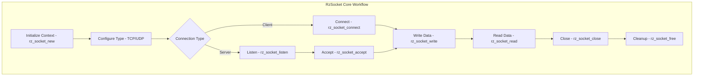

# RzSocket

The Rizin socket library, `RzSocket`, provides network communication functionality for remote debugging, remote analysis, and network-based interactions. It offers a cross-platform socket abstraction layer for TCP, UDP, and other network protocols.

The `RzSocket` structure manages network connections and communication operations.

## What can I expect here?

- Network communication support:
  - TCP connections (client and server)
  - UDP connections
  - Unix domain sockets (on supported platforms)
  - SSL/TLS secure connections
- Core functions for socket operations:
  - `rz_socket_new()`: Create socket context
  - `rz_socket_connect()`: Connect to remote host
  - `rz_socket_listen()`: Listen for connections
  - `rz_socket_accept()`: Accept client connection
  - `rz_socket_write()`: Send data
  - `rz_socket_read()`: Receive data
  - `rz_socket_close()`: Close connection
  - `rz_socket_free()`: Release socket context
- Socket options and configuration:
  - Timeout settings
  - Non-blocking mode
  - Keep-alive options
- Protocol support:
  - Raw TCP/UDP
  - GDB protocol for remote debugging
  - Custom protocols

## Architecture

The socket library provides cross-platform abstraction:

- **`RzSocket` Context**: Main socket manager
- **Platform Abstraction**: Handle OS-specific socket operations
- **Protocol Handlers**: Support different protocols
- **Connection Management**: Manage active connections

## RzSocket Core Workflow


## Key Structures

### RzSocket
Main socket context containing:
- Socket file descriptor
- Host and port information
- Connection state
- Timeout configuration
- Buffer management

### Connection Types

- **TCP Client**: Outgoing TCP connection
- **TCP Server**: Listening for connections
- **UDP**: Connectionless UDP communication
- **Unix Socket**: Local IPC via sockets

## Usage Examples

### Example: TCP Client Connection

```c
#include <rz_socket.h>
#include <stdio.h>

int main(void) {
	// Create socket
	RzSocket *sock = rz_socket_new(false);
	if (!sock) {
		return 1;
	}

	// Connect to remote host
	if (!rz_socket_connect(sock, "localhost", 9090)) {
		fprintf(stderr, "Failed to connect\n");
		rz_socket_free(sock);
		return 1;
	}

	// Send data
	const char *message = "Hello, server!";
	int sent = rz_socket_write(sock, (ut8 *)message, strlen(message));
	printf("Sent %d bytes\n", sent);

	// Receive data
	ut8 buffer[256];
	int received = rz_socket_read(sock, buffer, sizeof(buffer) - 1);
	if (received > 0) {
		buffer[received] = '\0';
		printf("Received: %s\n", (const char *)buffer);
	}

	// Close connection
	rz_socket_close(sock);
	rz_socket_free(sock);
	return 0;
}
```

### Example: TCP Server

```c
RzSocket *sock = rz_socket_new(true);  // true = listen socket
if (!sock) {
	return 1;
}

// Listen for connections
if (!rz_socket_listen(sock, "localhost", 9090)) {
	fprintf(stderr, "Failed to listen\n");
	rz_socket_free(sock);
	return 1;
}

printf("Listening on localhost:9090\n");

// Accept client connection
RzSocket *client = rz_socket_accept(sock);
if (client) {
	// Read from client
	ut8 buffer[256];
	int received = rz_socket_read(client, buffer, sizeof(buffer) - 1);
	
	if (received > 0) {
		printf("Received %d bytes from client\n", received);
		
		// Echo back
		rz_socket_write(client, buffer, received);
	}
	
	// Close client connection
	rz_socket_close(client);
	rz_socket_free(client);
}

// Close server socket
rz_socket_close(sock);
rz_socket_free(sock);
```

### Example: Timeout and Non-blocking

```c
RzSocket *sock = rz_socket_new(false);

// Set timeout to 5 seconds
rz_socket_set_read_timeout(sock, 5);

// Connect with timeout
if (rz_socket_connect(sock, "example.com", 80)) {
	// Send HTTP request
	const char *request = "GET / HTTP/1.0\r\n\r\n";
	rz_socket_write(sock, (ut8 *)request, strlen(request));
	
	// Read response with timeout
	ut8 buffer[1024];
	int size = rz_socket_read(sock, buffer, sizeof(buffer) - 1);
	
	if (size > 0) {
		printf("Received %d bytes\n", size);
	} else {
		printf("Timeout or error reading\n");
	}
}

rz_socket_close(sock);
rz_socket_free(sock);
```

### Example: UDP Communication

```c
// Create UDP socket
RzSocket *sock = rz_socket_new(false);
rz_socket_set_udp(sock, true);

// Connect to UDP server
rz_socket_connect(sock, "localhost", 5353);

// Send UDP packet
const char *data = "DNS query";
rz_socket_write(sock, (ut8 *)data, strlen(data));

// Receive UDP response
ut8 buffer[512];
int received = rz_socket_read(sock, buffer, sizeof(buffer));

if (received > 0) {
	printf("Received UDP response: %d bytes\n", received);
}

rz_socket_close(sock);
rz_socket_free(sock);
```

## Protocol Support

### TCP (Transmission Control Protocol)
Reliable connection-oriented protocol:
- Guaranteed delivery
- In-order delivery
- Connection setup/teardown

### UDP (User Datagram Protocol)
Connectionless unreliable protocol:
- Fast delivery
- No connection overhead
- No delivery guarantee

### Unix Domain Sockets
Local inter-process communication (IPC):
- On POSIX systems (Linux, macOS, BSD)
- File-based addressing
- High performance for local communication

### SSL/TLS
Secure encrypted connections:
- Secure data transmission
- Certificate-based authentication
- Available on supported platforms

## Socket Options

### Timeout
Set read/write operation timeout.

### Non-blocking
Enable non-blocking mode for operations.

### Buffer Size
Configure send/receive buffer sizes.

### Keep-Alive
Enable TCP keep-alive for long connections.

### Reuse Address
Allow socket address reuse.

## Key Features

- **Cross-platform**: Works on Linux, Windows, macOS
- **Protocol Agnostic**: Support multiple protocols
- **Timeout Support**: Configurable operation timeouts
- **Non-blocking**: Asynchronous operations
- **SSL/TLS**: Secure connections
- **Error Handling**: Detailed error reporting
- **Buffer Management**: Efficient data buffering

## Connection States

- **Disconnected**: No active connection
- **Connecting**: Connection in progress
- **Connected**: Active connection
- **Listening**: Waiting for incoming connections
- **Closed**: Connection terminated

## Error Handling

Socket operations return:
- Positive: Success (bytes read/written)
- Zero: Connection closed
- Negative: Error

## Integration Points

- **RzCore**: Remote debugging via sockets
- **GDB Protocol**: Remote debugging with GDB
- **Network Tools**: Socket-based network utilities
- **Remote Analysis**: Distributed analysis

## Performance Considerations

- Connection pooling for multiple sessions
- Buffering reduces system calls
- Non-blocking mode for async operations
- Timeout configuration prevents hangs

## Security Considerations

- Use SSL/TLS for sensitive communications
- Validate peer certificates
- Implement authentication
- Rate limiting for servers
- Sanitize network input

## Use Cases

1. **Remote Debugging**: Debug via network
2. **Remote Analysis**: Analyze on remote machines
3. **Network Tools**: Create network utilities
4. **IPC**: Local process communication
5. **Protocol Implementation**: Implement custom protocols

## Limitations

- Blocking operations can freeze application
- Network I/O latency affects performance
- Firewall and NAT may block connections
- SSL/TLS overhead for encryption
