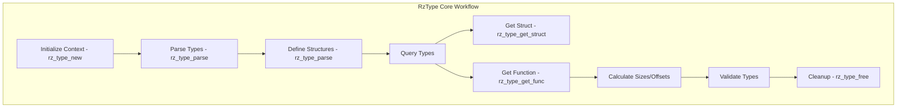

# RzType

The Rizin type library, `RzType`, provides comprehensive type system management and parsing. It handles data type definitions, type relationships, and enables semantic analysis of typed data structures found in binaries.

The `RzType` structure manages type definitions and enables type-aware binary analysis.

## What can I expect here?

- Type system management:
  - Primitive types (int, long, char, float, etc.)
  - Composite types (struct, union, enum)
  - Pointer and array types
  - Function types and signatures
- Type parsing and manipulation:
  - Parse C-like type declarations
  - Type relationship analysis
  - Type validation
- Core functions for type operations:
  - `rz_type_new()`: Create type context
  - `rz_type_parse()`: Parse type from string
  - `rz_type_set_function()`: Define function type
  - `rz_type_get_struct()`: Get struct definition
  - `rz_type_free()`: Release type context
- Type information extraction:
  - Type size calculation
  - Field offset calculation
  - Inheritance hierarchies
- Advanced features:
  - Type inference
  - Generic/template types
  - Function prototypes
  - Calling convention information

## Architecture

The type system uses a hierarchical architecture:

- **`RzType` Context**: Main type manager
- **Type Definitions**: Stored type information
- **Type Parser**: Parse type declarations
- **Type Graph**: Relationships between types

## RzType Core Workflow


## Key Structures

### RzType
Main type system context containing:
- Type definitions registry
- Type parser
- Configuration
- Type cache

### RzTypeItem
Individual type definition with:
- Type name
- Type kind (primitive, struct, etc.)
- Size information
- Members (for composite types)
- References

### RzTypeStruct
Structure type definition with:
- Field list
- Field names and offsets
- Field types

### RzTypeFunc
Function type with:
- Return type
- Parameter types
- Calling convention

## Supported Type Categories

### Primitive Types
- **Integers**: int, short, long, long long
- **Signed/Unsigned**: signed, unsigned variants
- **Floating Point**: float, double, long double
- **Characters**: char, wchar_t
- **Void**: void type

### Composite Types
- **Structures**: struct with named fields
- **Unions**: overlapping field layouts
- **Enumerations**: named integer constants
- **Bit Fields**: struct members with bit precision

### Derived Types
- **Pointers**: ptr to type
- **Arrays**: type[size]
- **Functions**: return_type(param_types)

## Usage Examples

### Example: Creating and Using Types

```c
#include <rz_type.h>
#include <stdio.h>

int main(void) {
	// Create type context
	RzType *types = rz_type_new();
	if (!types) {
		return 1;
	}

	// Define a simple structure
	const char *struct_def = 
		"struct Point {"
		"  int x;"
		"  int y;"
		"}";

	// Parse and define structure
	rz_type_parse(types, struct_def);

	// Get struct definition
	RzTypeStruct *point_struct = rz_type_get_struct(types, "Point");
	if (point_struct) {
		printf("Struct Point defined\n");
		printf("Size: %d bytes\n", point_struct->size);
		
		// Iterate over fields
		void **it;
		rz_pvector_foreach(point_struct->members, it) {
			RzTypeStructMember *member = (RzTypeStructMember *)*it;
			printf("  Field: %s @ offset %d\n", 
				member->name, member->offset);
		}
	}

	// Cleanup
	rz_type_free(types);
	return 0;
}
```

### Example: Function Type Definitions

```c
RzType *types = rz_type_new();

// Define function signature
const char *func_sig = "int read(int fd, char *buf, int len)";
rz_type_parse(types, func_sig);

// Get function type
RzTypeFunc *func = rz_type_get_func(types, "read");
if (func) {
	printf("Function: read\n");
	printf("Return type: %s\n", func->ret_type);
	printf("Parameters: %d\n", rz_list_length(func->args));
	
	// Iterate over parameters
	void **it;
	rz_list_foreach(func->args, it) {
		RzTypeArg *arg = (RzTypeArg *)*it;
		printf("  Param: %s %s\n", arg->type, arg->name);
	}
}

rz_type_free(types);
```

### Example: Type Size and Offset Calculation

```c
RzType *types = rz_type_new();

// Define complex structure
const char *struct_def = 
	"struct Data {"
	"  char flag;"          // 1 byte
	"  int value;"          // 4 bytes (aligned)
	"  long *ptr;"          // 8 bytes
	"  short array[10];"    // 20 bytes
	"}";

rz_type_parse(types, struct_def);

RzTypeStruct *data_struct = rz_type_get_struct(types, "Data");
if (data_struct) {
	printf("Struct size: %d bytes\n", data_struct->size);
	
	// Get offset of specific field
	int offset = rz_type_get_field_offset(types, "Data", "ptr");
	printf("Offset of 'ptr' field: %d\n", offset);
}

rz_type_free(types);
```

### Example: Parsing Type Strings

```c
RzType *types = rz_type_new();

// Parse various type expressions
const char *type_strings[] = {
	"int",
	"int *",
	"int **",
	"int[10]",
	"int (*)[10]",
	"int (*)(int, int)",
	"struct Point",
	"struct Point *",
	NULL
};

for (int i = 0; type_strings[i]; i++) {
	RzType *parsed = rz_type_parse_string(types, type_strings[i]);
	if (parsed) {
		printf("Parsed: %s\n", type_strings[i]);
	}
}

rz_type_free(types);
```

## Type Declaration Syntax

### Basic Types
```c
int                    // 32-bit integer
long                   // Platform-dependent long
float                  // 32-bit float
char                   // Character
void                   // No type
```

### Pointers
```c
int *                  // Pointer to int
int **                 // Pointer to pointer
const int *            // Pointer to const int
int * const            // Const pointer to int
```

### Arrays
```c
int[10]                // Array of 10 ints
int[10][20]            // 2D array
int[]                  // Unbounded array
```

### Functions
```c
int (int, int)         // Function taking 2 ints, returning int
int (*)(int)           // Pointer to function
```

### Structures
```c
struct Point {
	int x;
	int y;
}

union Data {
	int i;
	float f;
}

enum Color {
	RED, GREEN, BLUE
}
```

## Key Features

- **Type Safety**: Validate type consistency
- **Size Calculation**: Determine type sizes with alignment
- **Offset Calculation**: Find field offsets in structures
- **Type Inference**: Deduce types from context
- **Format Support**: C-like type syntax
- **Extensible**: Add custom types
- **Caching**: Efficient type lookup

## Type Relationships

### Inheritance
- Class inheritance hierarchies
- Virtual method tables

### Composition
- Nested structures
- Member types

### Derivation
- Pointers to types
- Arrays of types

## Integration Points

- **RzBin**: Extract type information from binaries
- **RzAnalysis**: Type-aware analysis
- **RzCore**: Type inspection commands
- **Decompilation**: Type information for output

## Use Cases

1. **Binary Analysis**: Understand data structures
2. **Decompilation**: Recover type information
3. **Vulnerability Analysis**: Analyze typed objects
4. **Signature Matching**: Match type patterns
5. **API Documentation**: Generate type docs

## Performance Considerations

- Type caching improves lookup
- Efficient type parsing
- Minimal memory for type storage
- Fast offset calculation

## Limitations

- Limited to C-like types
- No full C++ template support
- Platform-specific sizes may vary
- Forward declarations need handling
